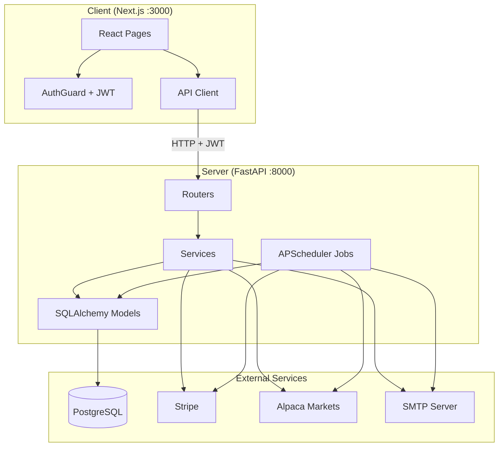
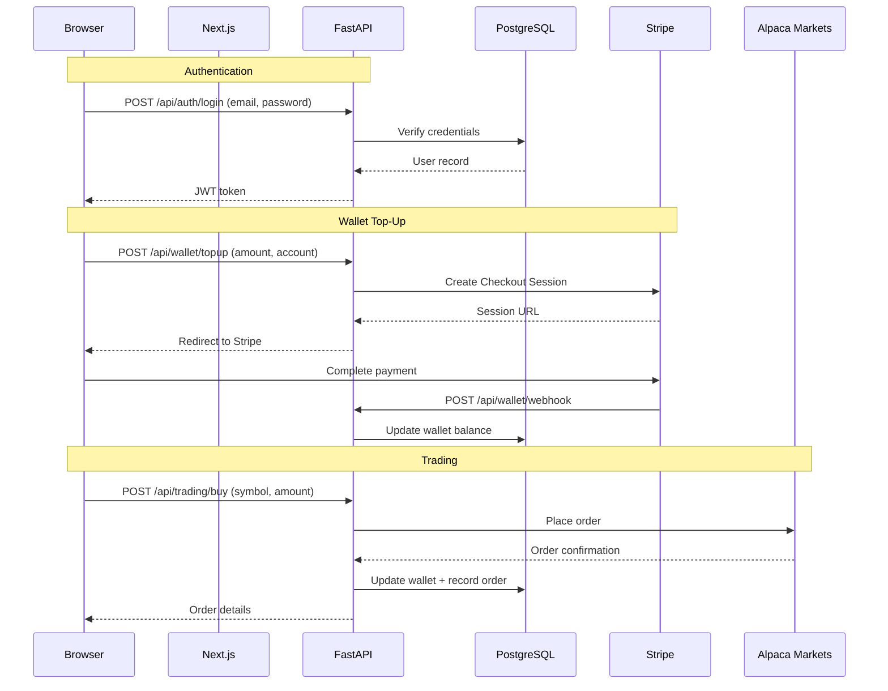

# Architecture

## System Overview



## Data Flow



## Technology Stack

| Layer | Technology | Version |
|-------|-----------|---------|
| Frontend | Next.js | 16 |
| Frontend | React | 19 |
| Frontend | TypeScript | 5 |
| Frontend | Tailwind CSS | 4 |
| Backend | Python | 3.12+ |
| Backend | FastAPI | latest |
| Backend | SQLAlchemy | 2 |
| Backend | Pydantic | 2 |
| Database | PostgreSQL | 16 |
| Auth | JWT (python-jose) | — |
| Auth | bcrypt | 4.0.1 |
| MFA | TOTP (pyotp) | — |
| Payments | Stripe API | latest |
| Trading | Alpaca Markets | paper API |
| Email | yagmail (SMTP) | — |
| PDF | ReportLab | — |
| Jobs | APScheduler | — |
| Migrations | Alembic | — |

## Directory Structure

```
fundinv-solo/
├── bin/
│   └── run.sh                         # Dev startup: Docker PG + FastAPI + Next.js
│
├── config/
│   ├── table/
│   │   └── v0.0.1_init_schema.sql     # Full DDL (17 tables, 2 schemas)
│   └── scripts/
│       └── v0.0.1_seed_data.sql       # Demo data (roles, users, funds, flows)
│
├── Server/
│   ├── main.py                         # App entry: FastAPI instance + router registration
│   ├── config.py                       # Pydantic Settings from .env
│   ├── database.py                     # SQLAlchemy engine, session, Base
│   ├── dependencies.py                 # get_current_user, require_role guards
│   ├── appconstants.py                 # Role names, claims, RBAC helpers
│   ├── requirements.txt                # Python dependencies
│   ├── alembic.ini                     # Migration config
│   ├── alembic/
│   │   ├── env.py                      # Migration environment
│   │   └── versions/                   # 7 migration scripts
│   ├── models/                         # 15 ORM models
│   │   ├── user.py                     # User, Role (fundinv_auth)
│   │   ├── role_claim.py               # RoleClaim (fundinv_auth)
│   │   ├── password_reset.py           # PasswordResetToken (fundinv_auth)
│   │   ├── fund.py                     # Fund, FundType enum (fundinv)
│   │   ├── fund_flow.py                # FundFlow — deposits/withdrawals
│   │   ├── fund_investment.py          # FundInvestment
│   │   ├── fund_targeting.py           # FundTargeting — investor visibility
│   │   ├── investment_account.py       # InvestmentAccount — wallet + allocations
│   │   ├── investor.py                 # Investor profile
│   │   ├── manager.py                  # Manager profile
│   │   ├── portfolio.py                # PortfolioHolding — daily snapshots
│   │   ├── transaction.py              # InvestmentTransaction — trade records
│   │   ├── order.py                    # Order — Alpaca orders
│   │   ├── audit_log.py                # AuditLog — event audit trail
│   │   └── invite.py                   # Invite — invitation tokens
│   ├── routers/                        # 8 API routers
│   │   ├── auth_routers.py             # /api/auth — login, register, MFA, invites
│   │   ├── admin_routers.py            # /api/admin — stats, users, fund flows, reconcile
│   │   ├── funds_routers.py            # /api/funds — browse, invest, stock details
│   │   ├── wallet_routers.py           # /api/wallet — Stripe topup, deposit/withdrawal
│   │   ├── portfolio_routers.py        # /api/portfolio — accounts, summary, chart, PDF
│   │   ├── trading_routers.py          # /api/trading — buy/sell via Alpaca
│   │   ├── articles_routers.py         # /api/admin/articles — Yahoo Finance news
│   │   └── manager_routers.py          # /api/manager — fund creation, investor mgmt
│   ├── services/                       # 5 business logic services
│   │   ├── auth_service.py             # bcrypt hashing, JWT create/decode
│   │   ├── email_service.py            # HTML emails (invite, fund flows)
│   │   ├── mfa_service.py              # TOTP generation + verification
│   │   ├── alpaca_service.py           # Alpaca API wrapper
│   │   └── audit_service.py            # Event logging
│   ├── schemas/                        # 3 Pydantic schema files
│   │   ├── auth_schema.py              # Login, register, token responses
│   │   ├── fund_schema.py              # Fund, invest request/response
│   │   └── portfolio_schema.py         # Account, topup, fund flow requests
│   └── jobs/                           # 6 background jobs
│       ├── scheduler.py                # APScheduler orchestrator
│       ├── reconcile_job.py            # DB vs Alpaca vs Stripe cross-check
│       ├── ai_rebalance.py             # Portfolio drift detection
│       ├── email_jobs.py               # Weekly/monthly summary emails
│       ├── cleanup_jobs.py             # Expired invite cleanup
│       └── migration_job.py            # Auto-run Alembic on startup
│
├── Client/
│   ├── app/
│   │   ├── layout.tsx                  # Root layout
│   │   ├── page.tsx                    # Landing page
│   │   ├── login/page.tsx              # Login form
│   │   ├── register/page.tsx           # Invite-based registration
│   │   ├── forgot-password/page.tsx    # Request password reset
│   │   ├── reset-password/page.tsx     # Set new password
│   │   ├── unauthorized/page.tsx       # Access denied
│   │   ├── components/                 # 8 shared UI components
│   │   │   ├── AuthGuard.tsx           # Role-based route protection
│   │   │   ├── Layout.tsx              # Page shell
│   │   │   ├── Header.tsx              # Nav bar
│   │   │   ├── Footer.tsx              # Footer + backend status
│   │   │   ├── Button.tsx              # Styled button
│   │   │   ├── Card.tsx                # Card container
│   │   │   ├── Input.tsx               # Form input
│   │   │   └── InviteModal.tsx         # Invite creation modal
│   │   ├── lib/                        # 3 utility files
│   │   │   ├── api.ts                  # HTTP client with auth
│   │   │   ├── auth.ts                 # JWT storage + decode
│   │   │   └── appconstants.js         # Roles + claims
│   │   └── dashboard/                  # Role-based dashboards
│   │       ├── admin/                  # Admin: 8 pages
│   │       │   ├── layout.tsx, page.tsx
│   │       │   ├── users/page.tsx
│   │       │   ├── investors/page.tsx
│   │       │   ├── fund-flows/page.tsx
│   │       │   ├── transactions/page.tsx
│   │       │   ├── wallet/page.tsx
│   │       │   ├── articles/page.tsx
│   │       │   └── settings/page.tsx
│   │       ├── manager/                # Manager: 4 pages
│   │       │   ├── layout.tsx, page.tsx
│   │       │   ├── funds/page.tsx
│   │       │   └── transactions/page.tsx
│   │       ├── operations/             # Operations: 3 pages
│   │       │   ├── layout.tsx, page.tsx
│   │       │   └── fund-flows/page.tsx
│   │       └── investor/               # Investor: 6 pages
│   │           ├── layout.tsx, page.tsx
│   │           ├── wallet/page.tsx
│   │           ├── funds/page.tsx
│   │           ├── articles/page.tsx
│   │           └── stock/[symbol]/page.tsx
│   ├── public/                         # Static assets
│   ├── package.json                    # Dependencies
│   ├── tsconfig.json                   # TypeScript config
│   └── postcss.config.mjs              # Tailwind config
│
├── .env.template                       # Environment variable template
└── README.md                           # This file
```
