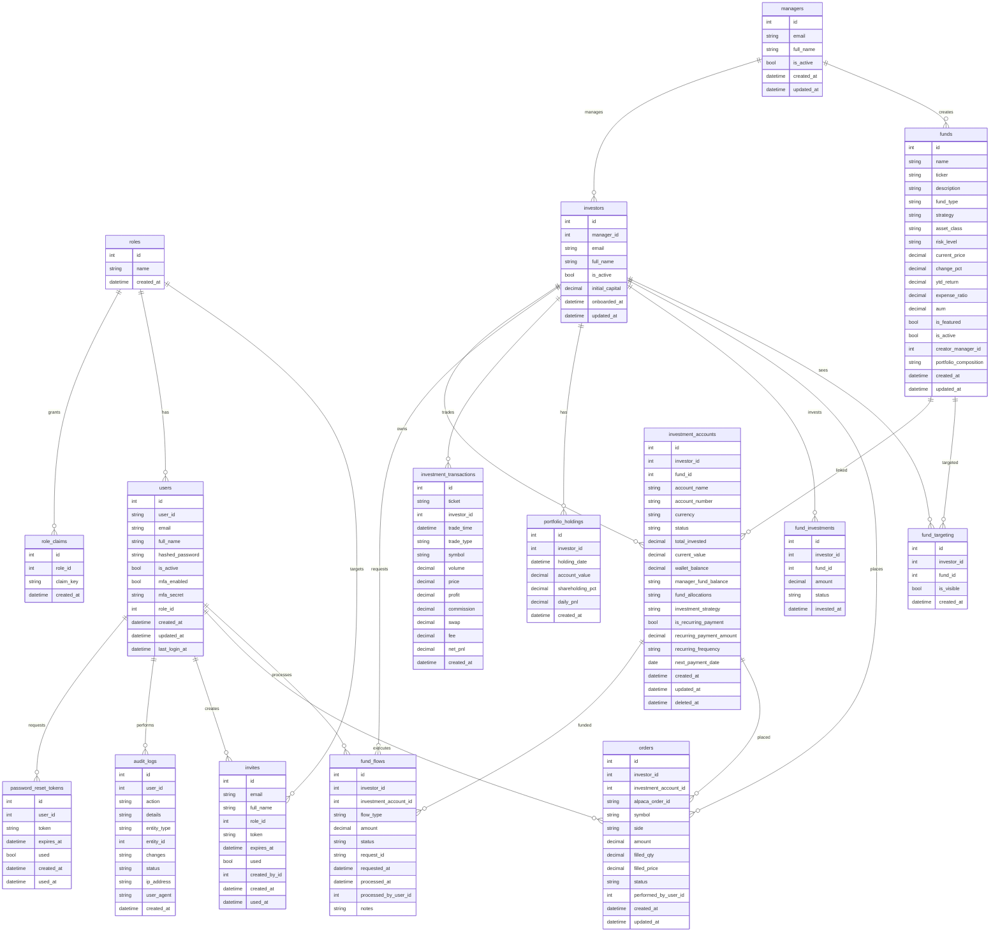
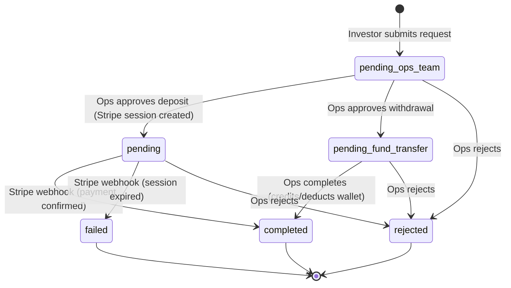

# Database Schema

## Entity-Relationship Diagram

## Schemas

The database uses two PostgreSQL schemas:

| Schema | Purpose | Tables |
|--------|---------|--------|
| `fundinv_auth` | Authentication & authorization | `roles`, `role_claims`, `users`, `password_reset_tokens` |
| `fundinv` | Business domain | `managers`, `funds`, `investors`, `fund_targeting`, `invites`, `investment_accounts`, `fund_flows`, `investment_transactions`, `portfolio_holdings`, `fund_investments`, `orders`, `audit_logs`, `alembic_version` |

## Table Descriptions

### fundinv_auth.roles
User roles. 4 seeded: `investor`, `manager`, `admin`, `operations`.

### fundinv_auth.role_claims
Granular RBAC permissions per role. Each claim is a `resource:action` string (e.g., `funds:create`, `fund_flows:approve`).

### fundinv_auth.users
User accounts. Each has a UUID `user_id` (public-facing) and a SERIAL `id` (internal FK). Supports MFA via `mfa_secret` column.

### fundinv_auth.password_reset_tokens
Time-limited tokens for password reset. Tokens expire based on `expires_at`. `used` flag prevents replay.

### fundinv.managers
Fund manager profiles. Linked to `fundinv_auth.users` by email. Auto-created on first manager login if profile doesn't exist.

### fundinv.funds
Investment funds/products. Supports multiple types (etf, stock, crypto, bond, managed, hedge_fund, mutual_fund, other). Managed funds are created by managers with a `creator_manager_id`. The `portfolio_composition` JSONB stores holdings as `[{symbol, allocation}]`.

### fundinv.investors
Investor profiles. Each is assigned to a manager (`manager_id`). Has `initial_capital` tracking and an `onboarded_at` timestamp.

### fundinv.fund_targeting
Controls which funds are visible to which investors. Each row is a unique `(investor_id, fund_id)` pair with an `is_visible` boolean. CASCADE deletes when fund or investor is removed.

### fundinv.investment_accounts
Investor portfolios. Each account holds:
- **`wallet_balance`** — available cash for trading/investing
- **`manager_fund_balance`** — JSONB tracking money allocated to manager funds per fund ID
- **`fund_allocations`** — JSONB tracking stock positions
- **`investment_strategy`** — one of: aggressive, growth, balanced, conservative, income
- Supports recurring payments and soft delete (`deleted_at`)

### fundinv.fund_flows
Deposit and withdrawal records. Key columns:
- **`flow_type`** — `deposit`, `withdrawal`, `investment`
- **`status`** — `pending` (Stripe), `pending_ops_team`, `pending_fund_transfer`, `completed`, `failed`, `rejected`
- **`request_id`** — unique identifier (Stripe session ID or generated `REQ-DEP-*`/`REQ-WTH-*`)
- **`processed_by_user_id`** — tracks which admin/ops user processed the flow

### fundinv.investment_transactions
Trade records (buy/sell). Each has a unique `ticket` ID, trade metadata, and P&L columns (`profit`, `commission`, `net_pnl`). `net_pnl` = realized profit - costs for sells; 0 for buys.

### fundinv.portfolio_holdings
Daily portfolio snapshots. Records `account_value`, `shareholding_pct`, and `daily_pnl` for each investor on a given `holding_date`.

### fundinv.fund_investments
Records of investor investments in specific funds. Links investor to fund with amount and status (`pending`, `completed`, `failed`).

### fundinv.orders
Trading orders placed via Alpaca. Stores `alpaca_order_id`, symbol, side (buy/sell), amount, fill details, status, and which user (`performed_by_user_id`) executed the order.

### fundinv.audit_logs
Immutable audit trail. Records every significant action with user, action type, target entity, JSONB changes, IP address, and user agent.

### fundinv.invites
Invitation tokens for user onboarding. Created by admins/managers. Each has a unique `token`, expiry, and `used` tracking. Linked to a target `role_id`.

## Fund Flow Status Lifecycle

## Permissions Matrix (v0.2.8+)

| Claim | investor | manager | operations | admin |
|-------|:--------:|:-------:|:----------:|:-----:|
| `dashboard:view` | ✓ | ✓ | ✓ | ✓ |
| `portfolio:read_own` | ✓ | ✓ | — | — |
| `portfolio:export` | ✓ | — | — | — |
| `wallet:request_deposit` | ✓ | — | — | — |
| `wallet:request_withdrawal` | ✓ | — | — | — |
| `funds:read` | ✓ | ✓ | — | ✓ |
| `funds:invest` | ✓ | — | — | — |
| `funds:create` | — | ✓ | — | — |
| `funds:update` | — | ✓ | — | — |
| `fund_composition:write` | — | ✓ | — | — |
| `fund_targeting:write` | — | ✓ | — | — |
| `investors:read_assigned` | — | ✓ | ✓ | — |
| `fund_flows:read_all` | — | — | ✓ | ✓ |
| `fund_flows:read_own` | ✓ | — | — | — |
| `fund_flows:approve` | — | — | ✓ | — |
| `fund_flows:complete` | — | — | ✓ | — |
| `fund_flows:reject` | — | — | ✓ | — |
| `fund_flows:initiate_deposit` | — | — | ✓ | — |
| `fund_flows:add_notes` | — | — | ✓ | — |
| `audit_logs:read` | — | — | ✓ | ✓ |
| `articles:read` | ✓ | ✓ | — | ✓ |
| `articles:write` | — | ✓ | — | ✓ |
| `invites:write` | — | ✓ | — | ✓ |
| `invites:read` | — | — | — | ✓ |
| `users:read` | — | — | — | ✓ |
| `users:write` | — | — | — | ✓ |
| `roles:read` | — | — | — | ✓ |
| `system_stats:read` | — | — | — | ✓ |
| `trading:execute` | — | ✓ | — | — |
| `transactions:read` | — | ✓ | — | — |

## Seed Data

Running `config/scripts/v0.0.1_seed_data.sql` creates:

| Section | Records |
|---------|---------|
| Roles | 4 (investor, manager, admin, operations) |
| Role Claims | 42 claims across all roles |
| Users | 6 (admin, manager, ops, 2 investors, system@fundinv.com) |
| Manager Profiles | 1 (linked to manager@fundinv.com) |
| Investor Profiles | 2 (investor@fundinv.com, alice@example.com) |
| Investment Accounts | 2 (Growth Portfolio, Balanced Portfolio) |
| Funds | 20 (QQQ, VOO, SPY, NVDA, TSLA, etc.) |
| Fund Targeting | Per-investor visibility rules |
| Fund Flows | 11 (deposits, withdrawals, ops-managed) |
| Investment Transactions | 7 (buy/sell AAPL, MSFT, NVDA, TSLA, AMZN) |
| Portfolio Holdings | 5 daily snapshots |
| Fund Investments | 4 (VOO, QQQ, SPY, BND) |
| Orders | 5 Alpaca orders |
| Audit Logs | 7 events |
| Invites | 3 pending invites |
| Password Reset Tokens | 2 tokens |

### System User

`system@fundinv.com` is a seeded inactive user (role: admin) used exclusively as an actor for audit events triggered by system processes (e.g., Stripe webhook completions). Its login is permanently disabled (`is_active = FALSE`).
