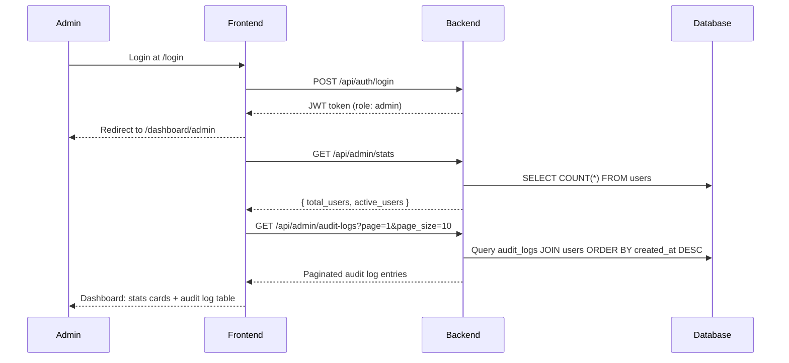
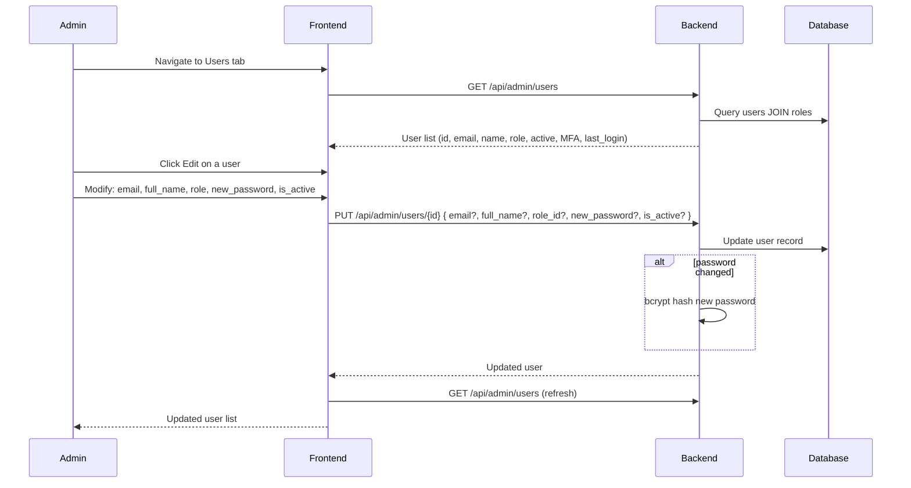
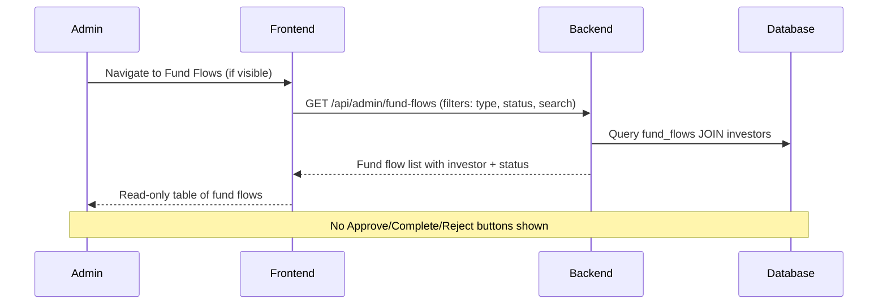
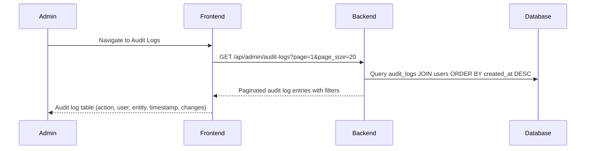
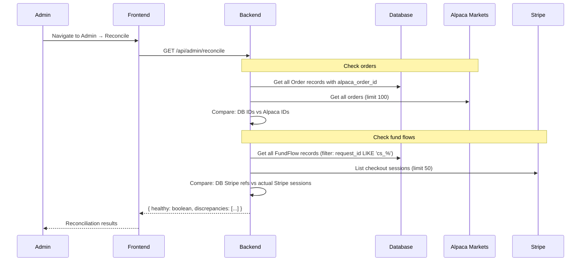

# Admin Flows

## 1. Login & Dashboard Flow

## 2. User Management Flow

## 3. Fund Flows View (Read-Only)

Admin can view fund flows but CANNOT approve, complete, or reject them. Those actions belong to Operations.

## 4. Audit Logs

## 5. Reconciliation Flow

## 6. Admin Scope Boundaries

**What Admin CAN do:**
- View all users, invites, roles (read-only)
- Create/update/deactivate user accounts
- Send invites via email
- View full audit logs with filters
- View system statistics
- View fund flows (read-only table)
- View fund catalogue
- Manage articles

**What Admin CANNOT do:**
- Approve, complete, or reject fund flows (Operations only)
- Create or edit funds (Manager only)
- Manage fund targeting (Manager only)
- Trade on behalf of investors (Manager only)
- View individual investor portfolio data
