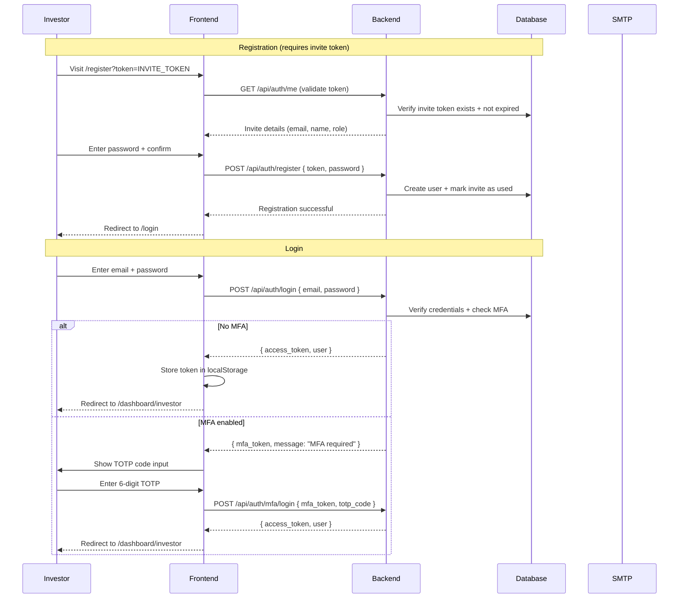
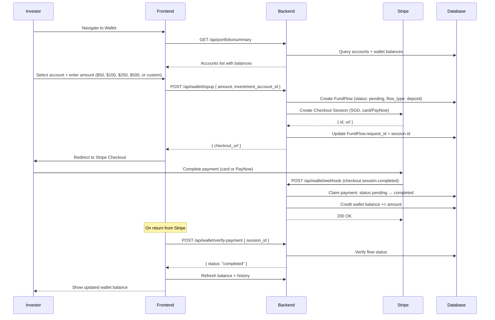
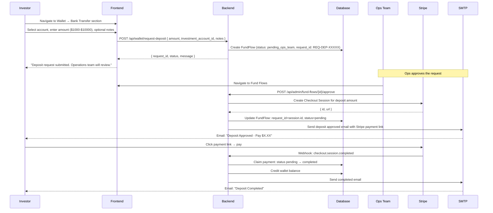
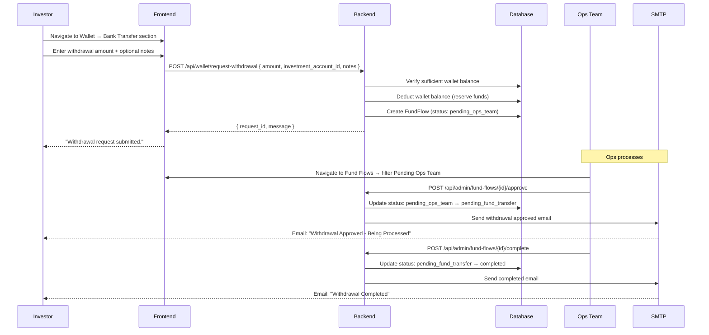
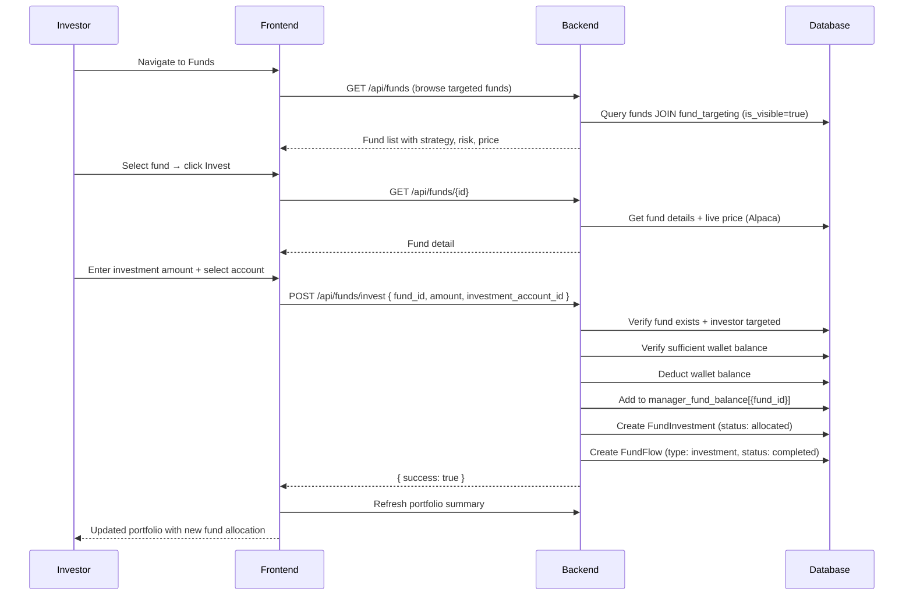
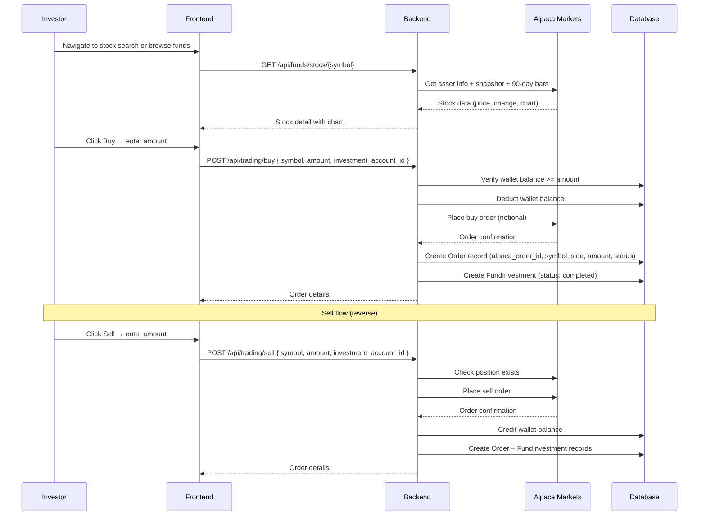

# Investor Flows

## 1. Onboarding Flow

## 2. Wallet Top-Up Flow (Stripe)

## 3. Deposit Request Flow (Ops-Managed)

## 4. Withdrawal Request Flow

## 5. Fund Investment Flow

## 6. Trading Flow

## Investor Scope Boundaries

**What Investor CAN do:**
- View own portfolio, balance, and transactions
- Browse fund catalogue (targeted funds only)
- Request deposits and withdrawals (Ops processes them)
- Invest in funds from wallet balance
- Export portfolio PDF
- Email portfolio summary
- Read articles

**What Investor CANNOT do:**
- Access any other investor's data or portfolio
- Manage funds or fund composition
- Manage fund targeting
- Approve or process fund flows
- Manage users or invites
- View audit logs or system stats
