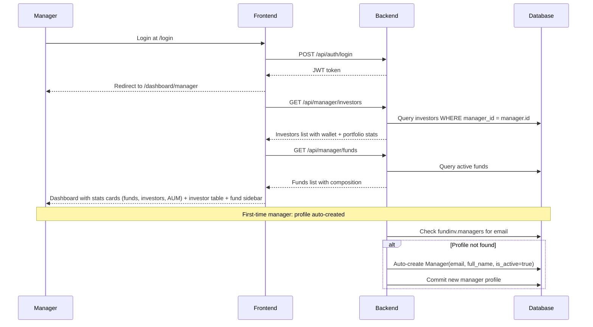
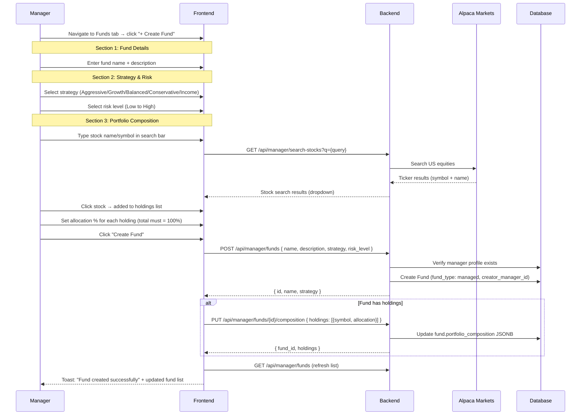
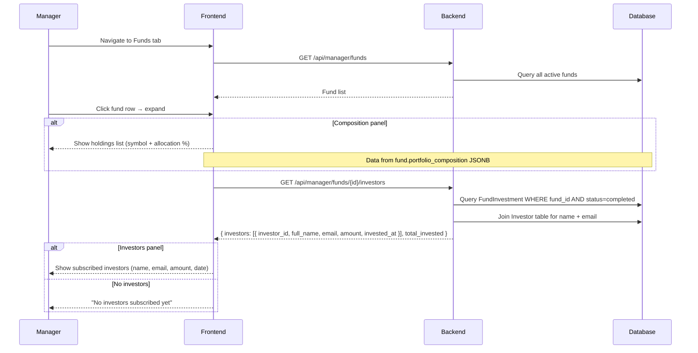
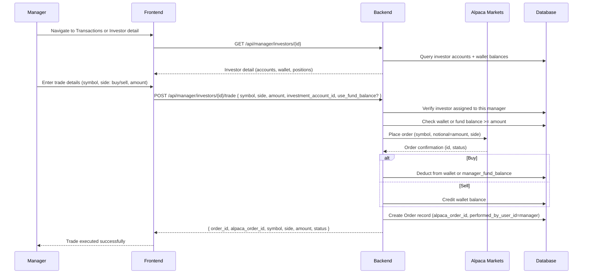
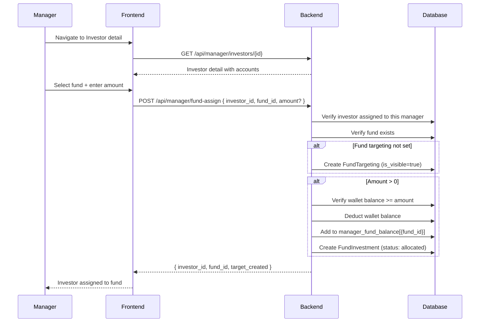

# Manager Flows

## 1. Login & Dashboard Flow

## 2. Fund Creation Flow

## 3. View Fund Investors Flow

## 4. Trade for Investor Flow

## 5. Fund Assignment Flow

## Manager Scope Boundaries

**What Manager CAN do:**
- Read fund catalogue, fund composition, fund targeting
- CRUD managed funds (create, update, manage composition)
- View assigned investor list, portfolio holdings, investment transactions
- Manage fund targeting (set investor visibility)
- Invite investors (auto-sets `investor.manager_id` to inviting manager)
- Execute trades on behalf of assigned investors
- Read and write articles

**What Manager CANNOT do:**
- Approve/completes/reject fund flows (Operations only)
- Initiate deposits or process withdrawals
- View other managers' investors or funds
- Manage users or system settings
- View audit logs
