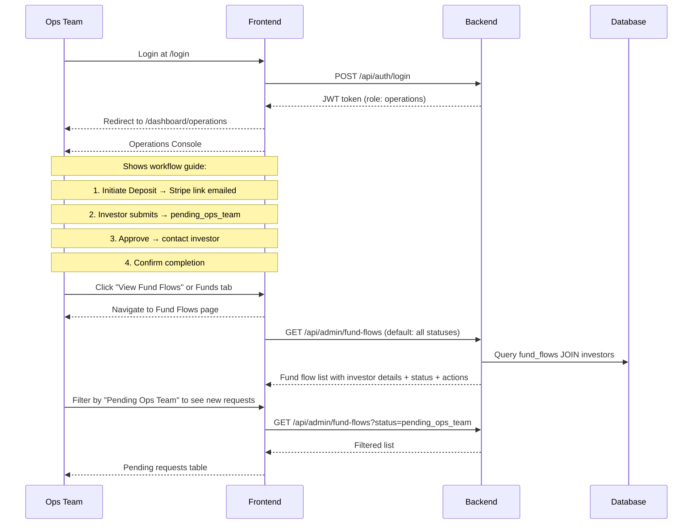
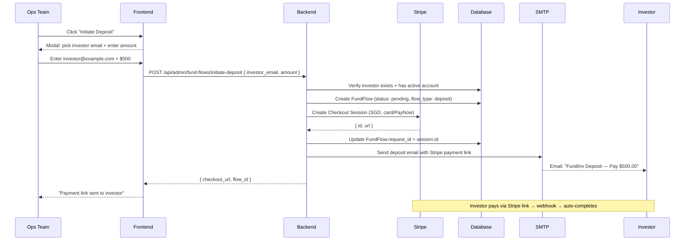
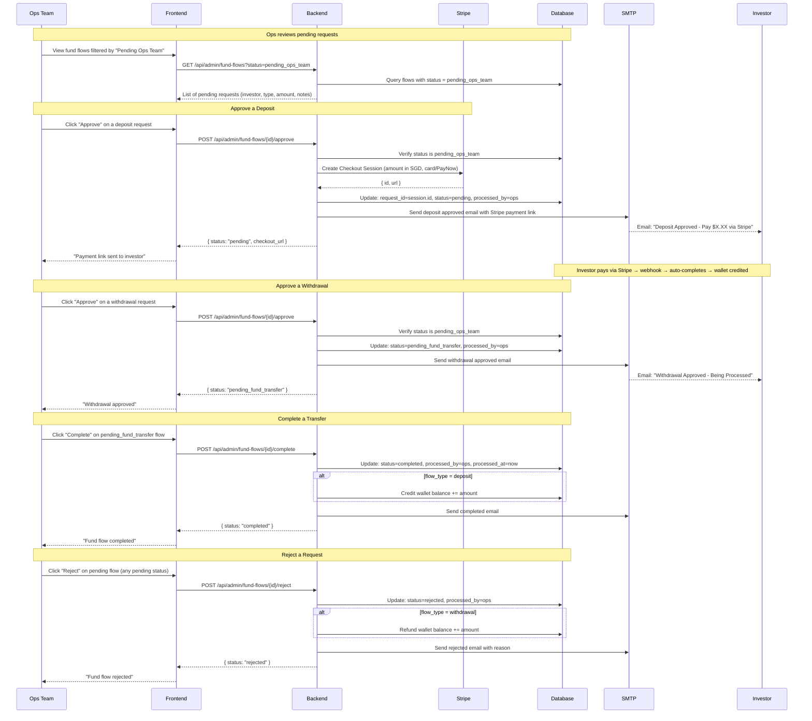
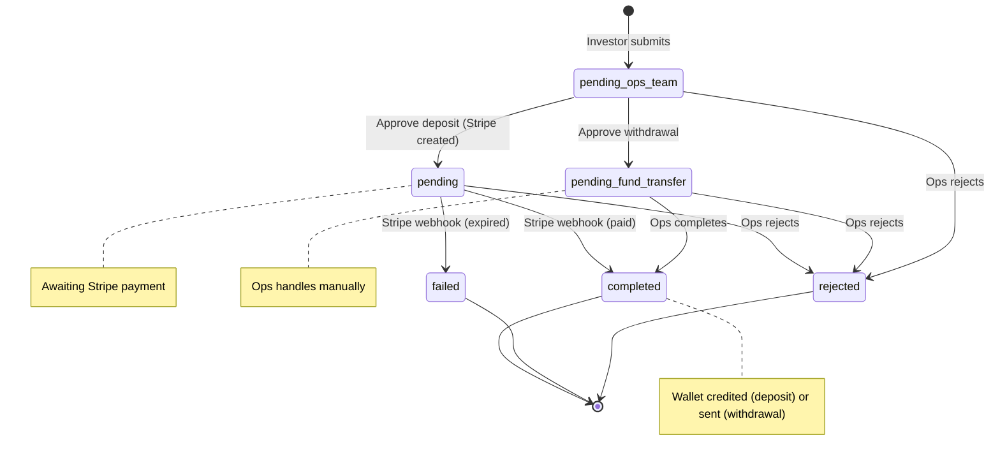

# Operations Flows

> Historical provider detail only. The current manual/Stripe-neutral approval
> and settlement boundary is defined in
> [Authoritative Fund Portal Workflow](../FUND_PORTAL_WORKFLOW.md).

## 1. Dashboard & Navigation Flow

## 2. Initiate Deposit for Investor (NEW)

## 3. Fund Flow Processing Flow

## Status State Machine

## Operations Scope Boundaries

**What Operations CAN do:**
- View ALL fund flow requests
- Initiate deposits on behalf of investors (send Stripe Checkout link)
- Approve / complete / reject fund flows
- Add notes to fund flow requests
- View investor account balances
- View own audit logs

**What Operations CANNOT do:**
- Browse fund catalogue / fund data
- View portfolio details / positions
- Create or edit funds
- Manage users or invites
- Trade on behalf of investors
- View articles (no `articles:read` claim)
