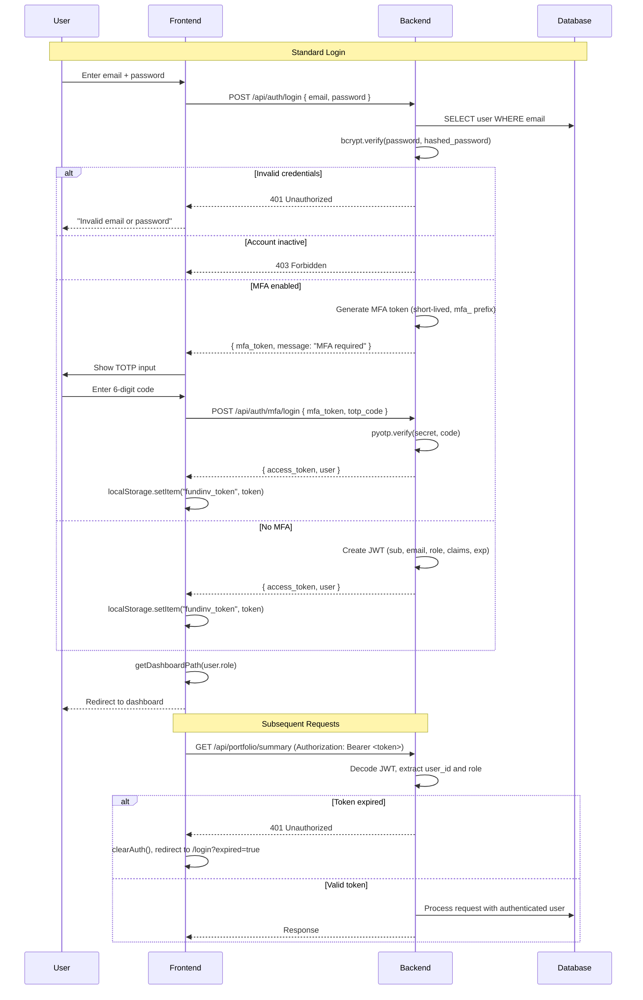
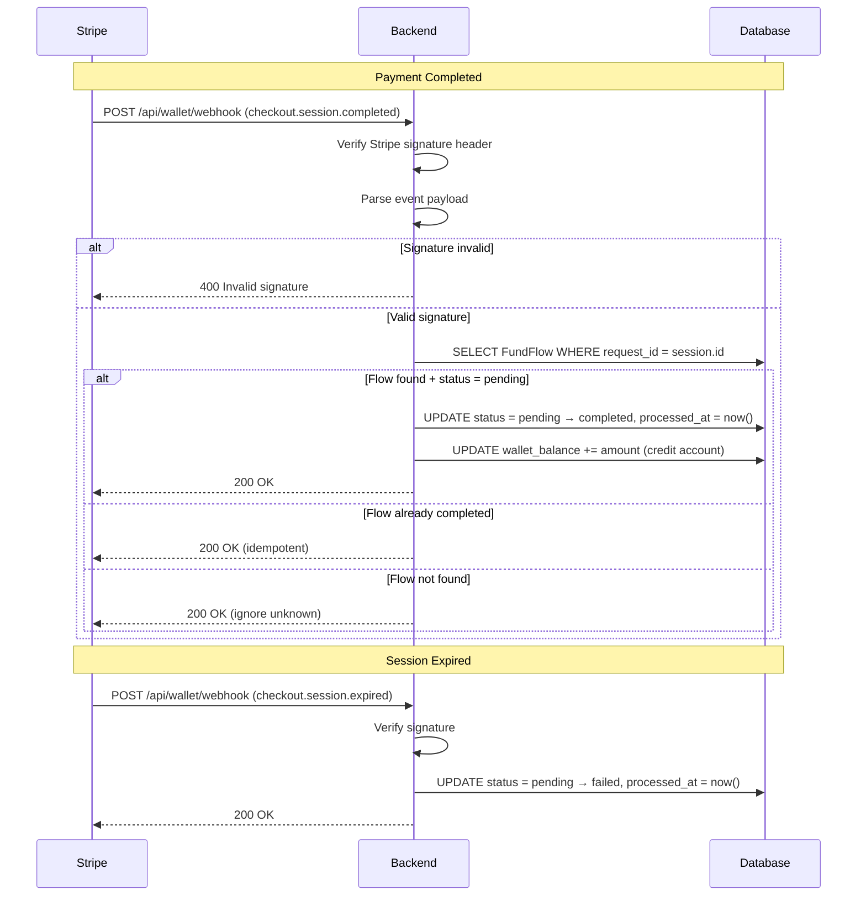
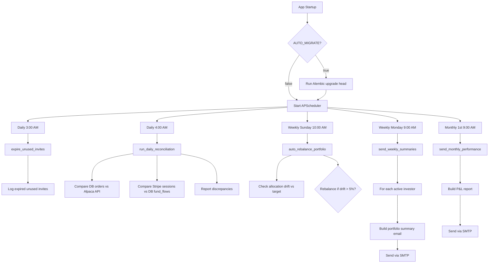
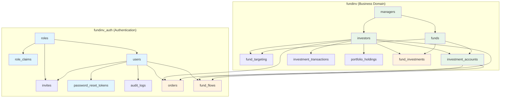

# System Flows

## 1. Authentication Flow



## 2. Stripe Webhook Flow



## 3. Email Notification Flow

```mermaid
sequenceDiagram
    participant Trigger as Trigger Event
    participant Service as Email Service
    participant Yag as yagmail
    participant SMTP as SMTP Server
    participant Recipient

    Trigger->>Service: Call email function (e.g., send_fund_flow_approved_email)

    Service->>Service: Build HTML template (inline CSS, branded header)
    Service->>Service: Format data (amount, request_id, flow_type)
    alt Deposit approved
        Service->>Service: Include Stripe checkout URL button
    else Withdrawal approved
        Service->>Service: Include processing confirmation
    end

    Service->>Yag: yag.send(to, subject, contents=html_body)
    Yag->>SMTP: Connect (settings.SMTP_EMAIL, settings.SMTP_PASSWORD)
    SMTP-->>Yag: Authenticated
    Yag->>SMTP: Send email
    SMTP-->>Recipient: Deliver email
    Yag-->>Service: Return True

    alt SMTP fails
        Service-->>Trigger: Return False (silently caught)
    end

    Note over Trigger,Recipient: Email Types
    Note over Trigger,Recipient: 1. Invite (user onboarding)
    Note over Trigger,Recipient: 2. Fund Flow Approved (deposit: Stripe link; withdrawal: confirmed)
    Note over Trigger,Recipient: 3. Fund Flow Completed (funds received/sent)
    Note over Trigger,Recipient: 4. Fund Flow Rejected (reason provided)
    Note over Trigger,Recipient: 5. Weekly Summary (portfolio performance)
    Note over Trigger,Recipient: 6. Monthly Performance (P&L report)
```

## 4. Scheduled Jobs Flow



## 5. Database Schema Relationships


